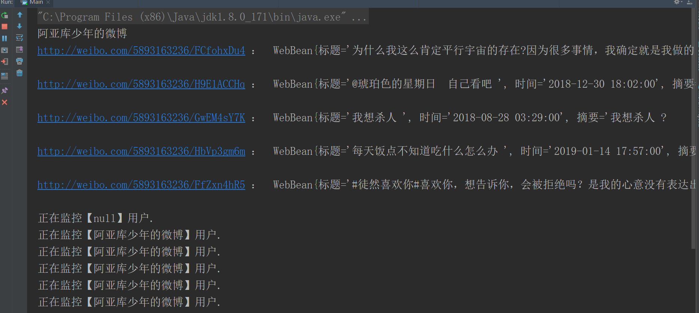
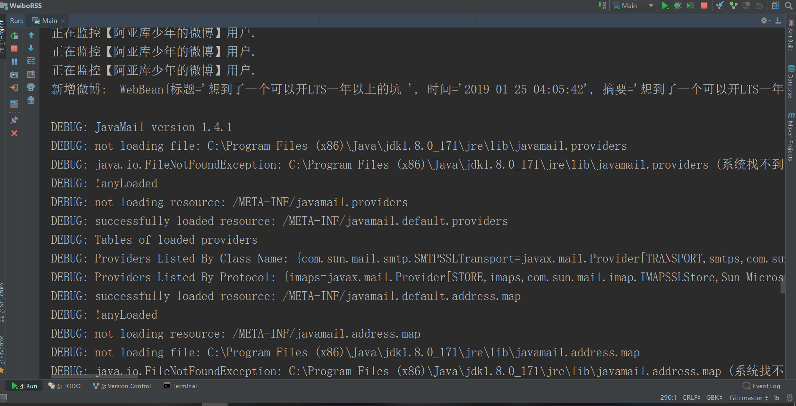
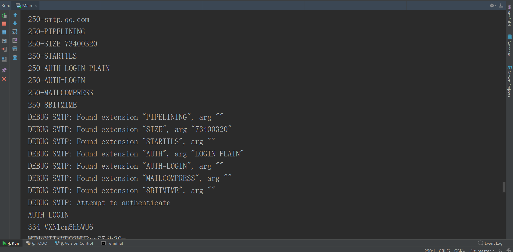

# WeiboRSS-
:raising_hand: Weibo subscription and sentiment analysis.

女朋友的微博情绪订阅

> 启动

> 监控到微博更新，发送邮件

| 用户更新 | 邮件提醒 |
| --------- | ----------|
|  |  | 

### 赞助

| 支付宝 | 微信 |
| ------------ | ------------ |
|  | |

但是随着项目规模的增长，也需要有相应的资金支持才能持续项目的维护与开发。你可以通过下列的方法来赞助项目的开发。你的名字会出现在项目的 GitHub 仓库和博客文档中。  